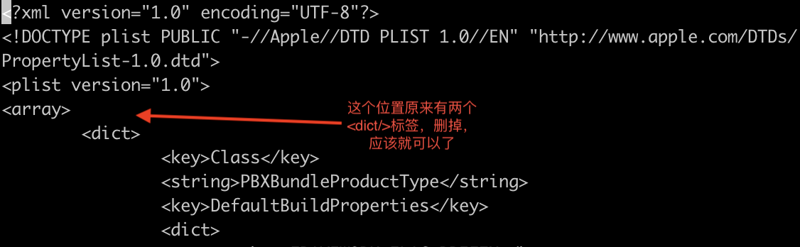

# theos
`sudo git clone --recursive https://github.com/theos/theos.git /opt/theos`
# ldid
安装brew，可以在知乎上找到brew的国内镜像
```
brew install ldid
```
# 软连接
用于xcode12及以上的版本
```
sudo ln -s /Applications/Xcode.app/Contents/Developer/Platforms/MacOSX.platform/Developer/Library/Xcode/PrivatePlugIns/IDEOSXSupportCore.ideplugin/Contents/Resources /Applications/Xcode.app/Contents/Developer/Platforms/MacOSX.platform/Developer/Library/Xcode/Specifications
```
# 官方
https://github.com/AloneMonkey/MonkeyDev/wiki/%E5%AE%89%E8%A3%85

# 打开闪退
`sudo vim /Applications/Xcode.app/Contents/PlugIns/IDEiOSSupportCore.ideplugin/Contents/Resources/Embedded-Device.xcspec`
