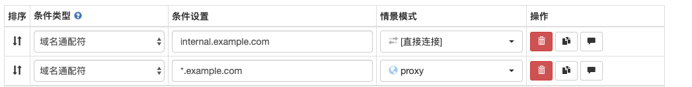
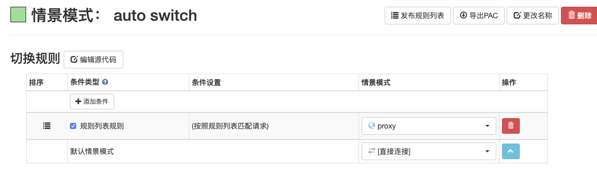
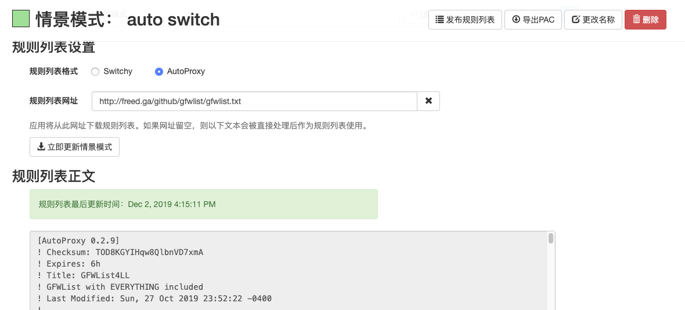

manjaro安装之后要进行一些配置才能更好的使用

这里只贴出我的最基本的配置

<!-- more -->

## 更换国内源
  ```bash
  sudo pacman-mirrors -i -c China -m rank
  ```
  记住你所选择的源
## 添加arch源
  ```bash
  sudo gedit /etc/pacman.conf
  ```
  进入编辑页面，添加
  ```
  [archlinuxcn]
  SigLevel = Optional TrustedOnly
  Server = https://mirrors.sjtug.sjtu.edu.cn/archlinux-cn/$arch
  ```
  将这个改成你刚才选中的源
## 更新数据库，并生成安装软件的key
  ```bash
  sudo pacman -Syy && sudo pacman -S archlinuxcn-keyring
  ```

## 升级系统
  ```bash
  sudo pacman -Su
  ```

## 安装常用的软件
  ```bash
  sudo pacman -S google-chrome           # 最流行的浏览器
  sudo pacman -S clang make cmake gdb    # 编译调试环境
  sudo pacman -S vim                     # 命令行下的编辑器
  ```

## 安装搜狗输入法
  ```bash
  sudo pacman -S fcitx-lilydjwg-git fcitx-sogoupinyin
  sudo pacman -S fcitx-configtool fcitx-qt5
  ```

  或者是
  ```bash
  sudo pacman -S fcitx-sogoupinyin
  sudo pacman -S fcitx-im
  sudo pacman -S fcitx-configtool  # 网上流传的一般到这就完了，但是由于搜狗长时间不更新，导致它所依赖的fcitx-qt4已经不再默认安装了，只能再有下面的命令安装
  sudo pacman -S yay
  yay -S fcitx-qt4
  ```

  安装完毕后，在~/.xprofile文件中添加
  ```
  export GTK_IM_MODULE=fcitx
  export QT_IM_MODULE=fcitx
  export XMODIFIERS="@im=fcitx"
  ```

  **最终我放弃了搜狗输入法，改用普通的拼音输入法，以上两种方法大家可以都尝试一下，可能会成功，不成功的话卸载掉就可以了**
  
  卸载命令
  ```
  sudo pacman -Rsn xxxx
  ```

## 安装ssr和chrome proxy配置
### ssr
  选择一个目录，我选择的是~/Documents/
  ```bash
  git clone https://github.com/ssrbackup/shadowsocksr
  ```
  完毕后
  ```bash
  cd shadowsocksr
  vim config.json
  ```
  进行配置

  ```bash
  python shadowsocks/local.py -c config.json # 启动
  python local.py -c/etc/shadowsocks.json -d start # 后台启动
  python local.py -c/etc/shadowsocks.json -d stop # 后台停止
  python local.py -c/etc/shadowsocks.json -d restart # 后台重启
  ```
  
  supervisor开机启动
  ```
  [program:shadowsocksr]
directory=/home/xxx/Documents/shadowsocksr
command=python /home/xxx/Documents/shadowsocksr/shadowsocks/local.py -c /home/xxx/Documents/shadowsocksr/config.json
autorestart=true
autostart=true
startretries=10
redirect_stderr=true
stdout_logfile=/home/xxx/Documents/shadowsocksr/supervisor.log
  ```

### chrome proxy
  1. 我用的是SwitchyOmega,[github下载](https://github.com/FelisCatus/SwitchyOmega/releases)
  2. 下载chrome用的crx包
  3. 下载后修改扩展名为zip
  4. 解压到当前目录
  5. 打开chrome，选择扩展程序，开发者模式，加载已经解压的扩展程序，加载刚才解压的文件
  6. 进入SwitchyOmega，选择proxy，将代理协议改为socks5，代理服务器为127.0.0.1，端口为1080
  7. 选择auto switch，删掉上面的两个可以删除的
  8. 在下面点击添加规则列表，设置成如图所示
  9. 点击AutoProxy,添加规则列表地址`https://gitlab.com/gfwlist/gfwlist/raw/master/gfwlist.txt`，如下图所示
  10. 应用，平时将扩展程序设置成auto switch模式就可以了。
#### 该部分摘自[小文的blog](https://www.qcgzxw.cn/2988.html)

## ll的配置
  ```bash
  vim ~/.bashrc
  ```
  添加
  ```
  alias ll='ls -alF'
  alias la='ls -A'
  alias l='ls -CF'
  ```
  保存退出之后
  ```bash
  source ~/.bashrc
  ```
