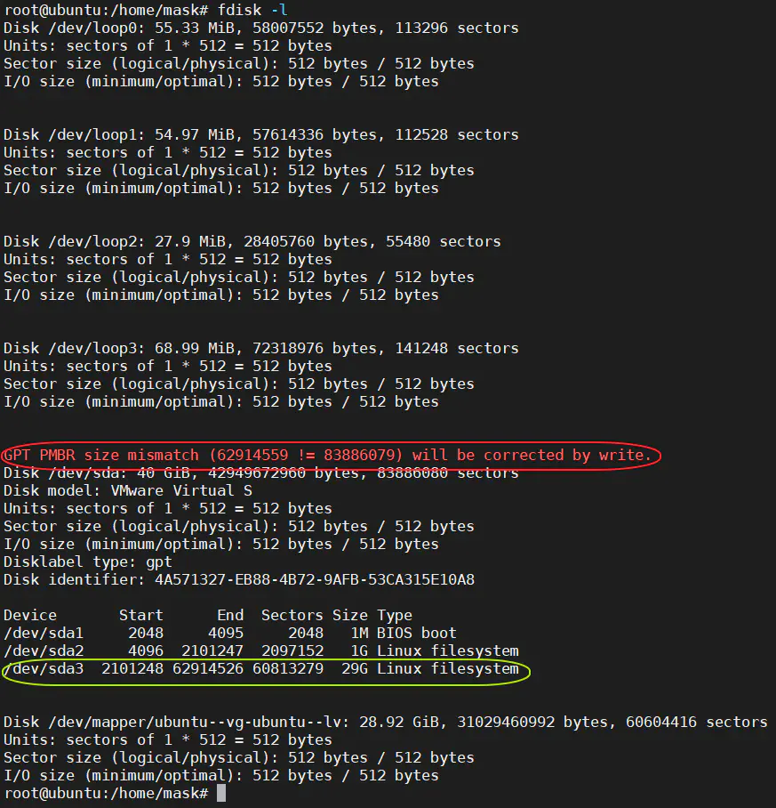
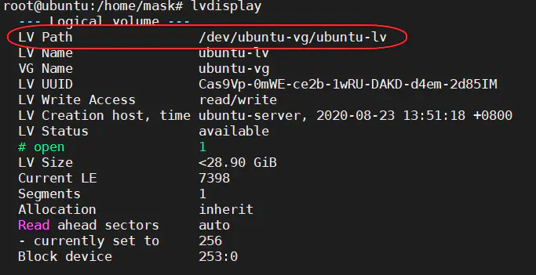
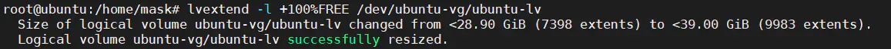
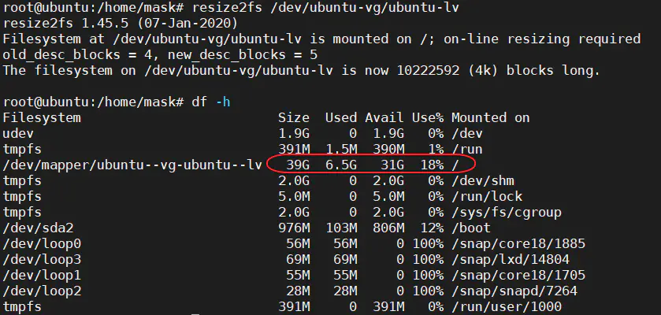

1. 先在vm中增加磁盘的容量
2. 在ubuntu中用df -h 看磁盘占用 和vm设置中的应该是不一样的
3. 输入fdisk -l，应该会看到下面两个 
4. 解决GPT PMBR size mismatch (62914559 != 83886079) will be corrected by write.
    1. 输入命令 parted -l 修复分区表
5. 使用 parted 追加容量到/dev/sda3    
    1. 输入命令 parted /dev/sda 
    2. 输入命令 unit s 设置Size单位，方便追加输入
    3. 输入命令 p free 查看详情
    4. 输入命令 resizepart 3 追加容量到sda3
    5. 输入空闲空间的end的数值，带单位s
    6. 输入命令 q 退出
6. 更新LVM中pv物理卷
    1. 输入命令 pvresize /dev/sda3 更新pv物理卷
    2. 输入命令 pvdisplay 查看状态
7. LVM逻辑卷扩容
    1. 输入命令 lvdisplay 
    2. 输入命令 lvextend -l +100%FREE /dev/ubuntu-vg/ubuntu-lv 逻辑卷扩容 
    3. 输入命令 resize2fs /dev/ubuntu-vg/ubuntu-lv 刷新逻辑卷 