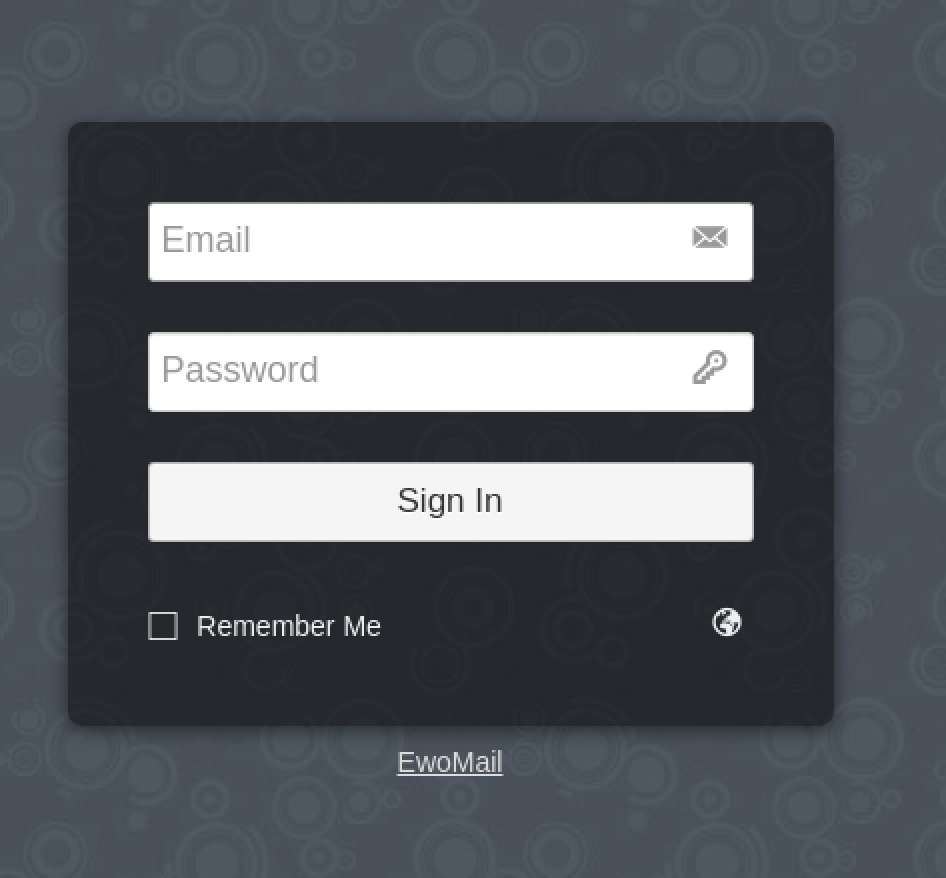

1. 开源版由于不支持邮箱别名，所以这个暂时被舍弃了。这里记录一下docker部署的过程
2. sudo pacman -S docker docker-compose
3. sudo systemctl start docker
3. vim docker-compose.yaml
```
version: '2.3'

services:
  portainer:
    image: "ewomail/ewomail"
    container_name: "ewomail"
    hostname: "mail.xxxxx.xxx"
    restart: always 
    ports:
      - "0.0.0.0:2210:22"
      - "0.0.0.0:25:25"
      - "0.0.0.0:109:109"
      - "0.0.0.0:110:110"
      - "0.0.0.0:143:143"
      - "0.0.0.0:465:465"
      - "0.0.0.0:587:587"
      - "0.0.0.0:993:993"
      - "0.0.0.0:995:995"
      - "127.0.0.1:8000:8000"
      - "127.0.0.1:8010:8010"
      - "127.0.0.1:8020:8020"
    volumes:
      - "/sys/fs/cgroup:/sys/fs/cgroup:ro"
    privileged: true
    tty: true
    stdin_open: true
```
4. 防火墙开放25和143端口，然后在路由器上设置25和143的端口映射
5. sudo docker search ewomail

安装ewomail/ewomail这个，是官方的
6. sudo docker pull ewomail/ewomail
7. sudo docker-compose -f docker-compose.yaml up -d
8. 可以尝试访问一下部署机器的127.0.0.1:8000和8010页面，我是用的桌面版linux，如果用的服务器，需要开放8000和8010端口并且修改一下docker-compose
    1. 8000
    
    2. 8010
    
    默认的用户名密码是admin，ewomail123
9. 登录8010页面
10. 修改默认的密码
11. 修改系统设置

12. 修改成自己的域名

13. 修改成自己的域名

14. 添加邮箱账户，邮箱的账户可以登录127.0.0.1:8000

15. 管理员账户还可以登录127.0.0.1:8000/?admin,邮箱账户后台管理页面
16. 修改docker里面的数据sudo docker exec -it ewomail bash
    1. vim /ewomail/www/ewomail-admin/core/config.php
    2. 
    把红框框起来的mail.ewomail.cn全都改成mail.xxxx.xxxx,应该可以避免域不允许的问题
    3. 这样改有个问题，如果不开放8000和8010端口，内部访问只能通过ip加端口号进行
17. 域名解析

参照http://doc.ewomail.com/docs/ewomail/main_domain，只有一个问题，就是dkim的生成，修改docker中的/etc/amavisd/amavisd.conf，把ewomail.cn修改成你自己的域名

18. 数据库连接

ewomail自带一个mysql网页客户端，127.0.0.1:8020访问，用户名和密码在docker中的/ewomail/config.ini查看，我只试了root的用户名密码，没有试ewomail的