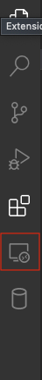
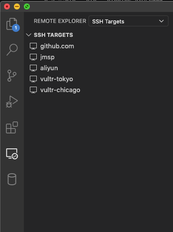
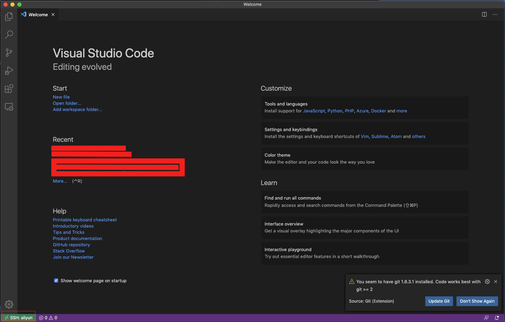

vscode真的厉害，我记得原来pycharm配置远程开发很难，今天突然看到vscode可以配置远程开发了。就试了一下，出乎意料的简单。

<!-- more -->

#### 安装插件
在插件里搜索`remote-ssh`。

安装成功后，左侧会出现如下图标

#### 选择服务器
点击小屏幕，出现这样的列表

因为我配置过ssh了，所以出现可以选择链接的服务器，没有配置过的，在`～/.ssh/config`进行配置。

#### 链接
鼠标在某个服务器名称上的时候，后面就会出现小窗口图标，点击就可以链接了

链接成功后，左下角出现你的服务器的名称

#### 断开链接
点击左下角链接成功的标志，选择close

或者直接关闭当前窗口