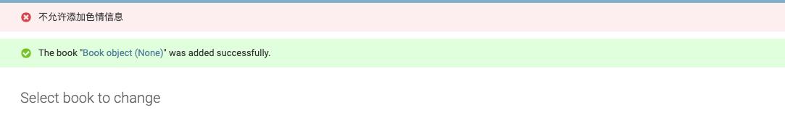
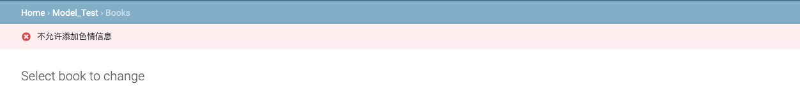

最近需要重写save_model方法，加上验证，如果失败返回错误信息  
网上有一些用message框架的感觉很麻烦，后来终于找到一个简单的实现办法  
# 基于django2.2.7
<!-- more -->
## models代码如下
```python
class Author(models.Model):
    name = models.CharField(max_length=255)


class Book(models.Model):
    author = models.ForeignKey(Author, on_delete=models.CASCADE)
    title = models.CharField(max_length=255)
```
## admin 代码如下
```python
from django.contrib import messages
@admin.register(Author)
class AuthorAdmin(admin.ModelAdmin):
    list_display = ('name',)


@admin.register(Book)
class BookAdmin(admin.ModelAdmin):
    list_display = ('author_name', 'title',)
    list_filter = ('author__name',)

    def author_name(self, obj):
        return obj.author.name

    # author_name.admin_order_field = 'author_name'
    author_name.short_description = '作者'

    def save_model(self, request, obj, form, change):
        if '色情' in obj.title:
            messages.error(request, '不允许添加色情信息')
            messages.set_level(request, messages.ERROR)
            return None
        return super(BookAdmin, self).save_model(request, obj, form, change)
```
直接使用django.contrib.messages 设置错误信息，并调整返回信息的级别  
用messages.set_level(request, messages.ERROR)将信息级别调整为ERROR后  
就不会再提示正确信息了
return None可以保证不存储  
如果没有设置set_level(request, messages.ERROR)就会发现既显示了错误信息，又显示创建成功

### meaasge_level设置前

### meaasge_level设置后
