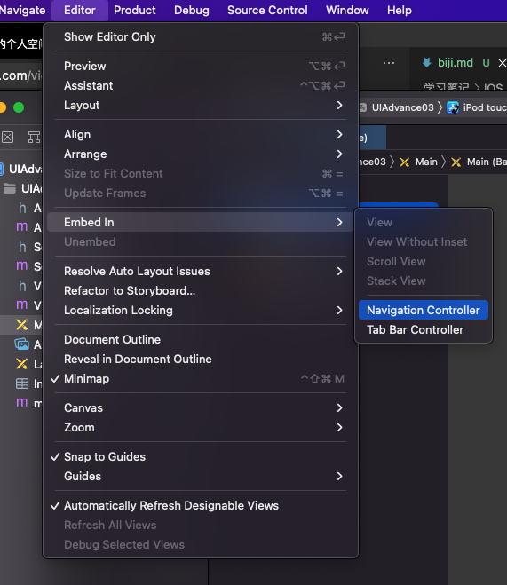

1. segue
    1. 自动型Segue 按住Control键，直接从控件拖线到目标控制器
        1. 点击某个控件后，不需要做任何判断，一定要跳转到下一个界面，建议使用自动型segue
    2. 手动型segue，需要一个identifier
        1. 在想要跳转的时刻，使用perform方法执行对应的Segue
            ```
            // Segue 必须由来源控制器来执行，也就是说，这个perform方法必须由来源控制器来控制
            [self performSegueWithIdentifier:@"login2contacts" sender:nil];
            ```
        2. 用在点击某个控件后，需要一些判断，也就是说，满足一定条件后才跳转到下一个界面，建议使用手动型Segue
    3. 在跳转前的准备工作，并传入创建好的segue对象，可以在里面获得目标controller和源controller
        ```
        - (void) prepareForSegue: (UIStoryboardSegue *)segue sender: (id) sender:
       // 这个sender 是当初performSegueWithIdentifier: sender: 中的sender
        ```
2. 在navigationItem上添加按钮
    ```
    // 添加注销按钮
    UIBarButtonItem* item = [[UIBarButtonItem alloc] initWithTitle:@"注销" style:UIBarButtonItemStylePlain target:self action: @selector(logOut)];
    self. navigationItem.leftBarButtonItem= item;
    ```
3. 添加alert
    ```
    UIAlertController *alert = [UIAlertController alertControllerWithTitle:@"确定注销吗?" message:nil preferredStyle:UIAlertControllerStyleActionSheet];
    UIAlertAction *action  = [UIAlertAction actionWithTitle:@"确定" style:UIAlertActionStyleDefault handler:^(UIAlertAction * _Nonnull action) {
        [self.navigationController popViewControllerAnimated:YES];
    }];
    [alert addAction:action];
    [self presentViewController:alert animated:YES completion:nil];
    ```
4. navigation
    1. 在当前的main.storyboard里面的默认的controller前面加上Navigation Controller 
5. textfield
    1. `[self.accountName addTarget:self action:@selector(textChange) forControlEvents:UIControlEventEditingChanged];`设置UIControlEventEditingChanged，addTarget是TextField的text发生变化时调用的
6. ViewController
    1. `viewWillAppear` view即将显示