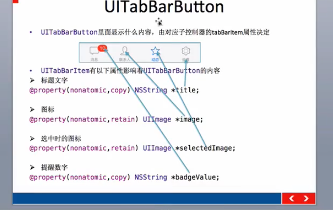

1. 应用沙盒 就是一个手机上的文件夹，每次的会变，动态的
    1. Documents 文件夹 保存应用运行时生成的需要持久化的数据，在做设备的同步的时候会备份该目录。比如游戏进度
    2. tmp文件夹 保存应用运行时所需的临时数据，使用完毕后再将相应的文件从该目录删除，应用没有运行时，系统也可能会删除该目录的文件。不会被同步
    3. Library/Caches: 保存引用运行时生成的需要持久化的数据，iTunes同步设备时不会备份。一般存储体积大，不需要备份的重要数据
    4. Library/Prefrence 保存应用的所有偏好设置，iOS的settings设置应用会在该目录中查找应用的设置信息。iTunes会备份，同步
    5. 获取沙盒的path `NSString *homePath = NSHomeDirectory();`
    6. 获取沙盒下Documents的路径 
        ```
        // 拼接的形式
        NSString *homePath = NSHomeDirectory();
        NSString *docPath = [homePath stringByAppendingPathComponent:@"Documents"];
        // 搜索的形式 常用 iOS系统更新造成的路径变化不会造成影响
        NSString *docPath = NSSearchPathForDirectoriesInDomains(NSDocumentDirectory, NSUserDomainMask, YES)[0];
        ```
    7. documets下的持久化
        ```
        NSArray NSDictionary 这两个的写入文件的方法，直接写入到documents目录下
        ```
    8. perferences持久化
        1. 存数据
            ```
            NSUserDefault *ud = [NSUserDefaults standardUserDefaults];
            // 注意设置object用对应的方法
            [ud setobject:@"value" forKey:@"key"];
            // 设置BOOL的值，用对应的方法
            [ud setBool:YES forKey:@"isOn"];
            // 立即写入 对应iOS7之前的版本需要
            [ud synchronize];
            ```
        2. 取数据
            ```
            // 取数据用对应的方法
            NSUserDefaults* ud = [NSUserDefaults standardUserDefaults];
            NSString *str = [ud objectForKey:@"key"];
            BOOL bo = [ud boolForKey:@"key"];
            ```
    9. 存档解档的方式
        1. 存档
            ```
            //获取tmp目录
            NSString* tmpPath = NSTemporaryDirectory();
            // 获取 file path
            NSString* filePath = [tmpPath stringByAppendingPathComponent:@"teacher.data"];
            //创建自定义对象
            Teacher* t = [[Teacher alloc] init];
            t.name = @'NIPESE";
            t.age = 18;
            [NSKeyedArchiver archiveRootObject:t tofile: filePath];
            ```
        2. 解档
            ```
            // 获取tmp目录
            NSString* tmpPath = NSTemporaryDirectory();
            // 获取 file path
            NSString* filePath = [tmpPath stringByAppendingPathComponent:@"teacher.data"];
            Teacher * t = [NSKeyedUnarchiver unarchiveObjectWithFile: filePath];
            ```
        3. 对应的对象的类要遵守一个协议
            ```
            <NSCoding>
            //告诉需要 需要归档哪些属性
            - (void)encodeWithCoder: (NSCoder*)aCoder{
                [Coder encode0bject: _name forKey:@"name"];
                [Coder encodeInt:_age forKey:@"age"];
            }
            //告诉系统解档哪些属性
            - (instancetype)initWithCoder:(NSCoder*)aDecoder{
                if (self = [super init]) {
                    _name = [aDecoder decodeObjectForKey:@"name"];
                    _age = [aDecoder decodeIntForkey:@"age"];
                }
                return self;
            }
            ```
2. NSString
    1. 拼接目录字符串
        ```
        NSString *homePath = NSHomeDirectory();
        NSString *docPath = [homePath stringByAppendingPathComponent:@"Documents"];
        ```
3. UISwitch
    ```
    获取打开状态用 isOn
    设置状态用 setOn:BOOL animate:YES
    ```
4. tableView
    1. 删除某个行
        ```
        // 删除某一行时 务必 先删除模型！！！！！！！！！！!！
        //把数组中的元素删掉
        [self.contacts removeObjectAtIndex:indexPath.row];

        //删除某一行 后面的动画选择哪一个都差不多
        [self.tableView deleteRowsAtIndexPaths:@[indexPath] withRowAnimation:UITableViewRowAnimationLeft];
        ```
5. UITabBarController的简单使用
    ```
    UITabBarController初始化
    设置UIWindow的rootViewController为UITabBarController
    根据具体情况，通过addChildViewController方法添加对应个数的子控制器
    ```
    1. 例子
        ```
        - (BOOL) application: (UIApplication*)application didFinishLaunchingWithOptions:(NSDictionary*)launchOptions{
            // 创建 window
            self.window = [[UIWindow alloc] initWithFrame:[UIScreen mainScreen].bounds];
            // 初始化tabbarController
            UITabBarController* tabbarController = [[UITabBarController alloc] initl:
            // 设置 window 的根控制器
            self.window.rootViewController = tabbarController;
            // 创建子控制器
            UIViewController* v1 = ([UIViewController alloc] init]:
            UIViewController* v2 = ([UIViewController alloc] init];
            UIViewController* v3 = ([UIViewController alloc] init];
            //设置背景颜色
            v1.view.backgroundColor = [UIColor redColor];
            v2.view.backgroundColor = [UIColor orangeColor];
            v3.view.backgroundColor = [UIColor blueColor];

            //设置标题
            v1.tabBarItem.title = @"联系人";
            v2.tabBarItem.title = @"消息";
            // 设置图片
            v1.tabBarItem.image = [UIImage imageNamed:@"tab_buddy_nor"];
            v2.tabBarItem.image = [UIImage imageNamed:@"tab_me_nor"];
            // 设置提醒内容
            v1.tabBarItem.badgeValue = @"998";

            // 添加子控制器
            [tabbarController addChildViewController:v1];
            [tabbarController addChildViewController:v2];
            [tabbarController addChildViewController:v3];
            // 设置window的根控制器
            self.window. rootViewController = tabbarController;

            // 显示
            [self.window makeKeyAndVisible);
            return YES;
        }
        ```
    2. UITabBarButton 