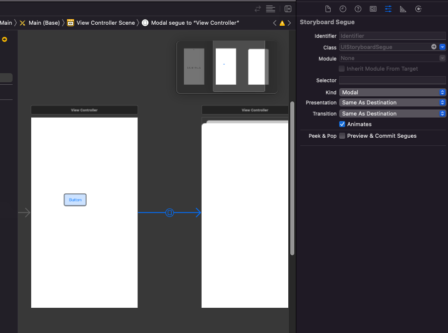
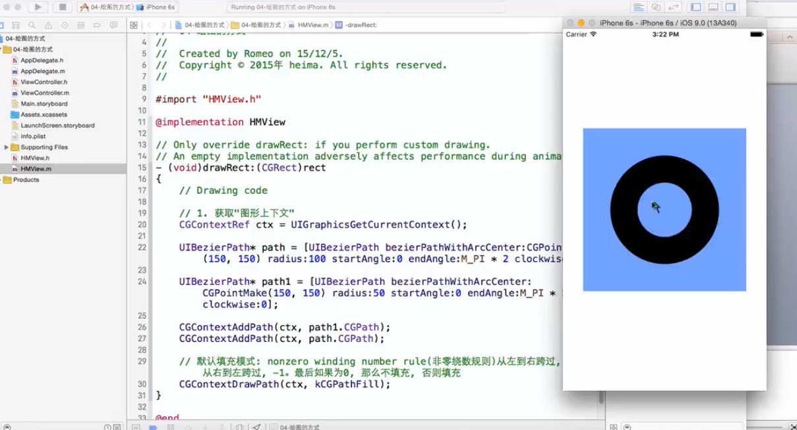
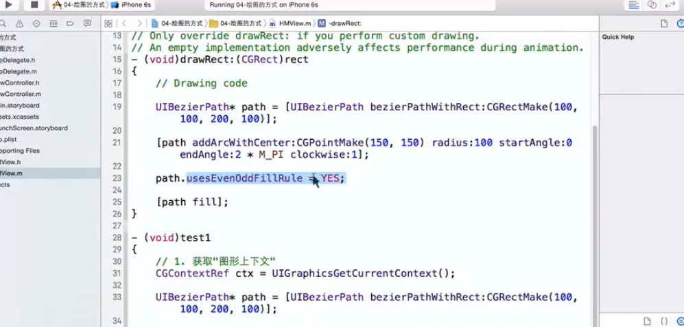

1. Modal方式拉线
    1. 弹出
    ```
    #import "ViewController.h"
    #import "ModalViewController.h"
    @interface ViewController ()
    @property(nonatomic, strong) UIViewController *controller;
    @end
    @implementation ViewController
    - (void)viewDidLoad {
        [super viewDidLoad];
        // Do any additional setup after loading the view.
    }
    - (void)touchesBegan:(NSSet<UITouch *> *)touches withEvent:(UIEvent *)event{
        // 新建controller
        ModalViewController *controller = [ModalViewController new];
        UIView *view = [UIView new];
        view.backgroundColor = [UIColor blueColor];
        controller.view = view;
        self.controller = controller;
        // 添加modal的特效
        controller.modalTransitionStyle = UIModalTransitionStylePartialCurl;
        // modal代码弹出
        [self presentViewController:controller animated:YES completion:^{
                NSLog(@"控制器已经显示");
        }];
    }
    @end
    ```
    2. 弹回
    ```
    #import "ModalViewController.h"
    @interface ModalViewController ()
    @end
    @implementation ModalViewController
    - (void)viewDidLoad {
        [super viewDidLoad];
        // Do any additional setup after loading the view.
    }
    - (void)touchesBegan:(NSSet<UITouch *> *)touches withEvent:(UIEvent *)event{
        // Modal代码撤回
        [self dismissViewControllerAnimated:YES completion:^{
                NSLog(@"modal界面撤回");
        }];
    }
    @end
    ```
    3. 拉线模式，直接拉线，然后就可以在属性中设置Modal 
2. Quartz2D绘图
    1. 主要步骤
        1. 获取图形上下文的对象
        2. 向图形上下文对象中添加路径
        3. 渲染(把图形上下文中的图形绘制到相应的设备上)
    2. C和OC都可以绘图
    3. 可以重绘
    4. 拉线的类型线宽的类型 
    5. 默认填充规则   
    6. 奇偶填充规则 
    7. OC奇偶填充规则 