## RSA加密方式
需要两个密钥

1. 公开密钥简称公钥
2. 私有密钥简称私钥

共钥加密，私钥解密
私钥加密，共钥解密

## 数学原理

### 离散对数问题

需要加密容易，破解难

所以选择了取模运算，取模运算也叫时钟运算

用质数做模数，比如17，再找一个比17小的数比如说3

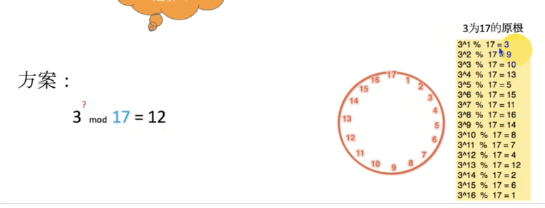

3的1-16次方模17的结果会留在1-16的任意一个点上，3称为17的原根

通过结果12去反算3的几次幂比较困难，只能试错

如果17长达几百位，反算就更加困难

这种被称为离散对数问题

### 欧拉函数

互质关系 如果两个正整数，除了1以外没有其他的公因数，就叫做互质关系

小于质数的数都与该质数构成互质关系
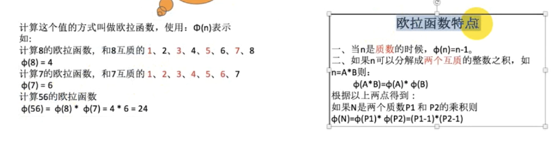

### 定理

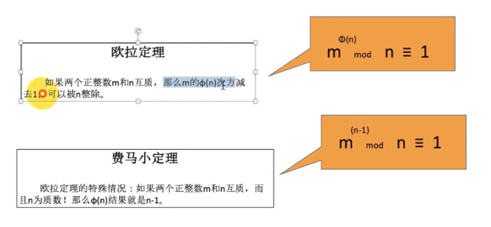

### 公式的变换
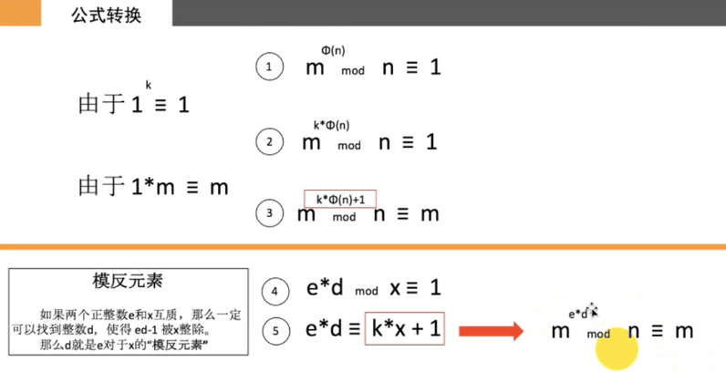

变换证明

1. 一到二的证明
    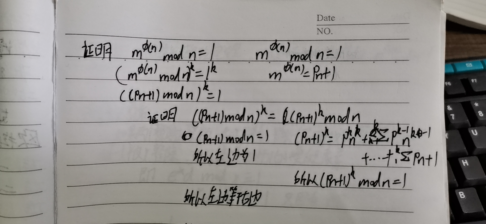
2. 2到3的证明
    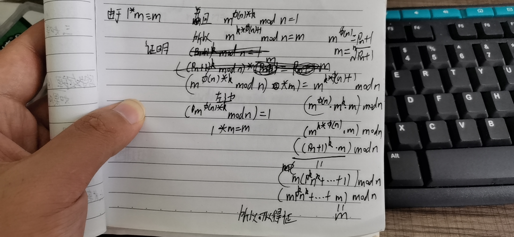

3. 1-3步的前提条件为欧拉定理，m和n都是正整数

4. 模反元素
    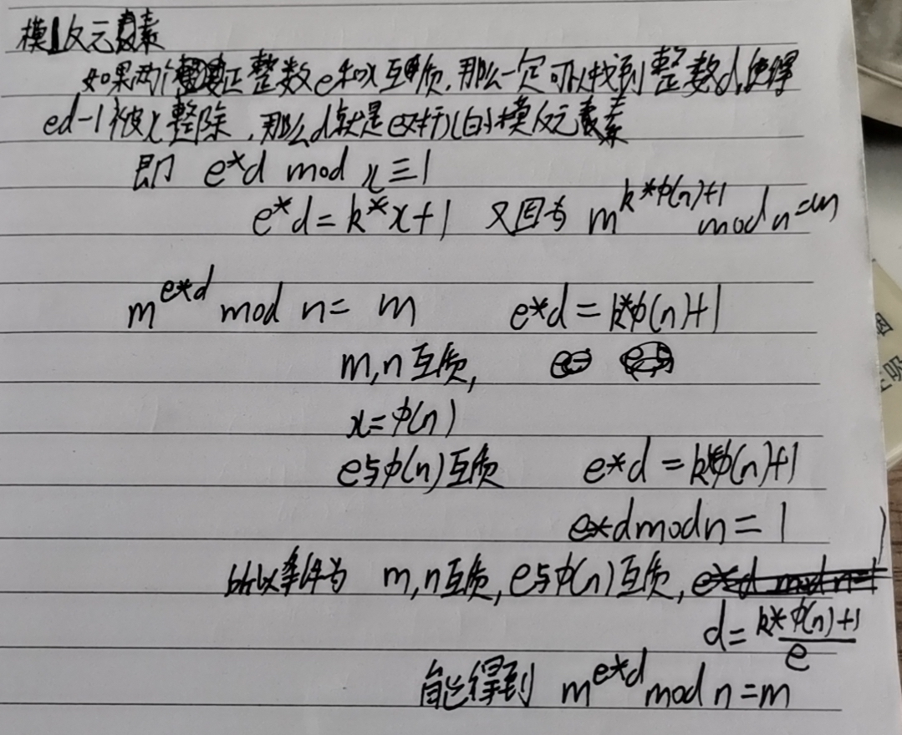

### 迪飞赫尔曼交换

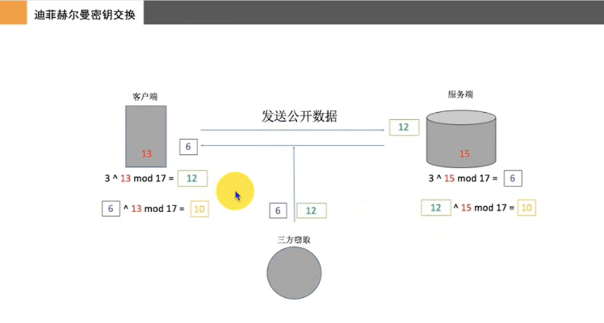

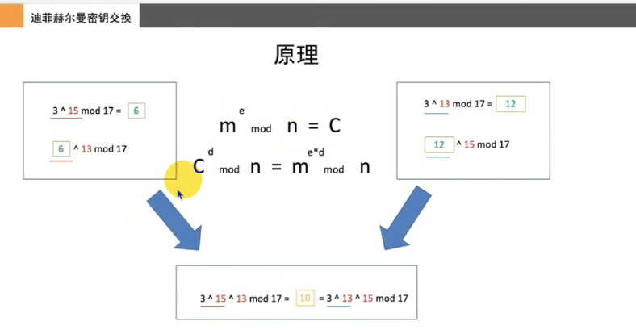

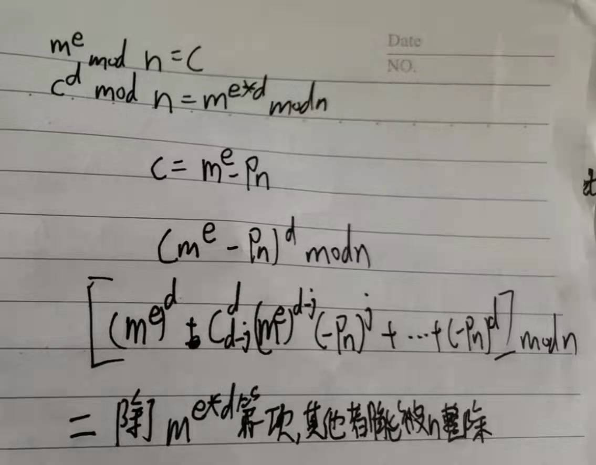

### RSA原理

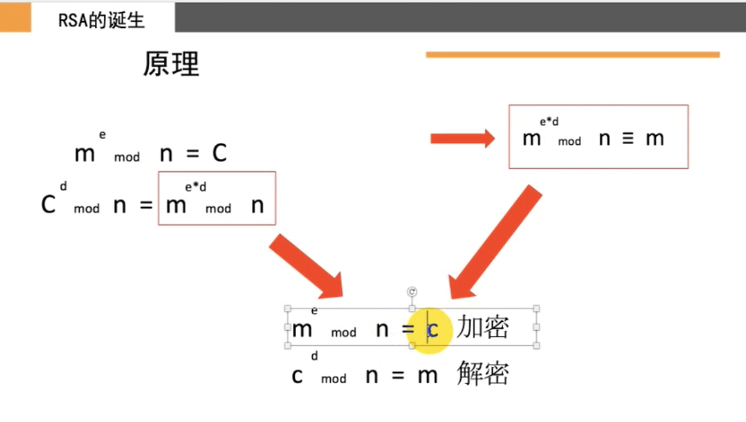

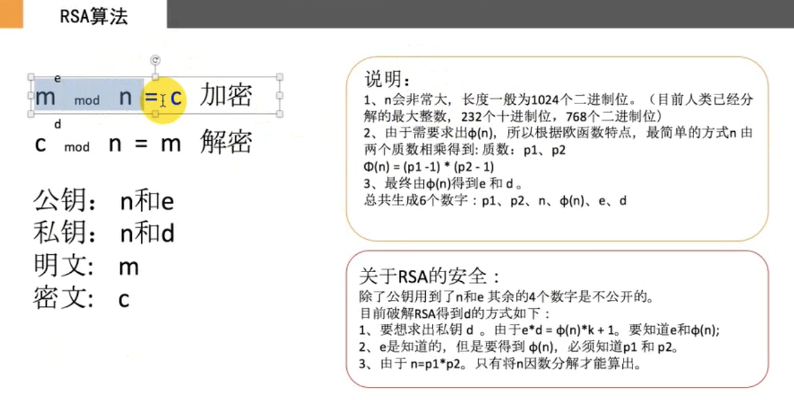

要破解其实就是得到n的欧拉函数

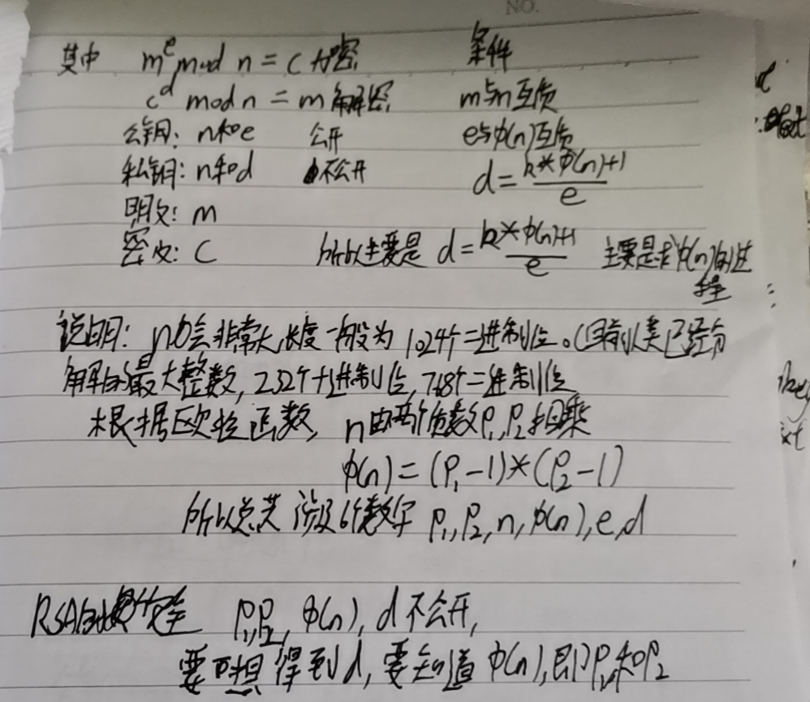

### RSA终端演示

RSA加密用于数字签名

RSA加密可以用于加密对称加密的KEY

Mac终端可以用Openssl进行RSA的生成

生成步骤

1. 生成RSA密钥 openssl genrsa -out private.pem 1024
2. 从私钥提取公钥 openssl rsa -in private.pem -pubout -out public.pem

生成的公钥，私钥都是base64编码的

3. 将私钥转为明文 openssl rsa -in private.pem -text -out private.txt

终端进行加密解密

4. 用公钥加密 openssl rsautl -encrypt -in message.txt -inkey public.pem -pubin -out enc.txt
5. 用私钥进行解密 openssl rsautl -decrypt -in enc.txt -inkey private.pem -out dec.txt

私钥sign，公钥verify

6. 私钥加密 openssl rsautl -sign -in message.txt -inkey private.pem -out enc.bin
7. 公钥解密 openssl rsautl -verify -in enc.bin -inkey public.pem -pubin -out dec.txt

### 证书生成步骤

工作中pem不常用，生成最终的使用的结果的步骤
1. openssl req -new -key private.pem -out rsacert.csr 从pem文件中提取证书文件
2. 然后用rsacert.csr文件去证书签发机构进行证书签名，签发机构签名的命令，openssl x509 -req -days 3650 -in rsacert.csr -signkey private.pem -out rsacert.crt 得到了crt证书用于https
3. 从证书中提取der文件 openssl x509 -outform der -in rsacert.crt -out rsacert.der der文件包含公钥
4. 生成p12文件，包含私钥信息 openssl pkcs12 -export -out p.p12 -inkey private.pem -in rsacert.crt。命令输入回撤后需要设置一个密码。

p12文件和der文件用于加解密文件。ios中一般是用这俩文件

### base64 编码

命令行中 base64 1.png -o out.txt
        base64 out.txt -o 1.png -D

