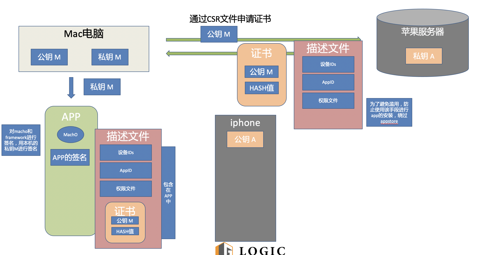
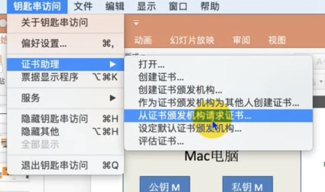
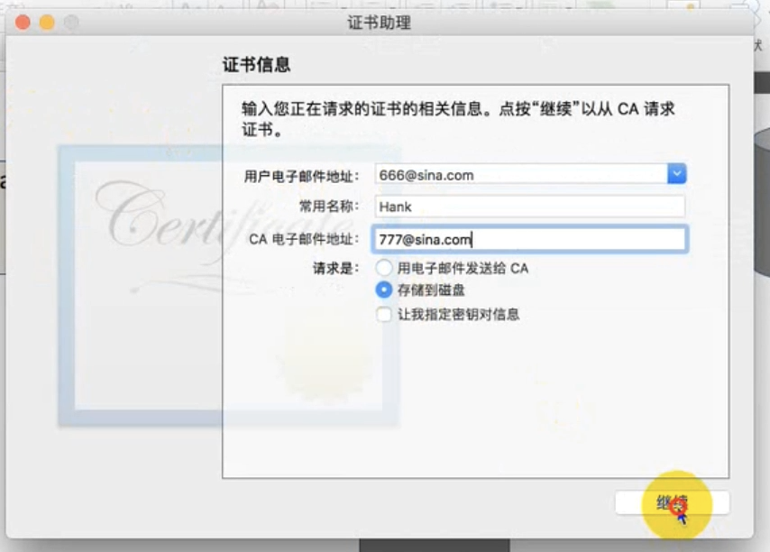
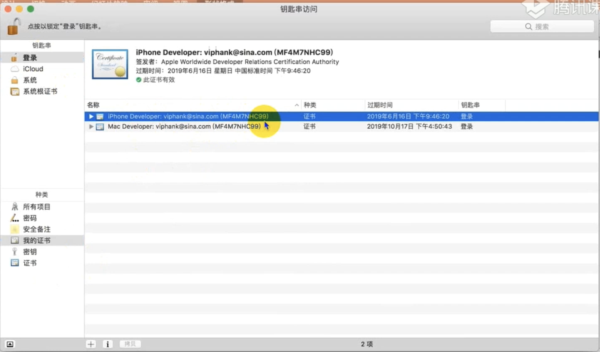
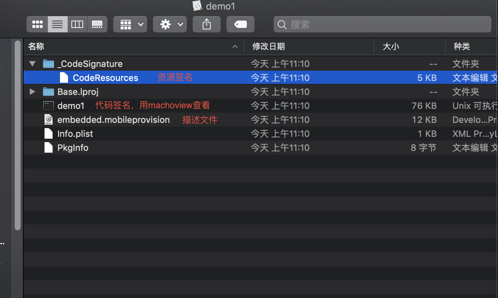
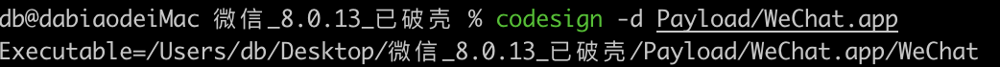
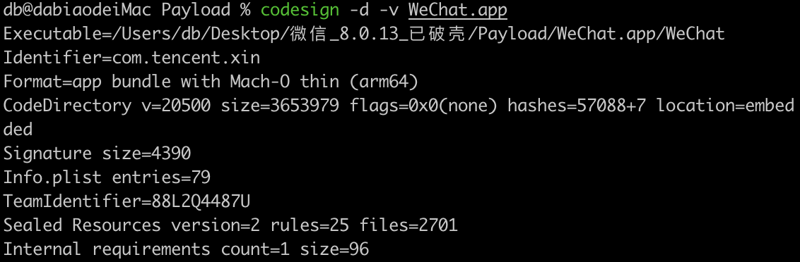
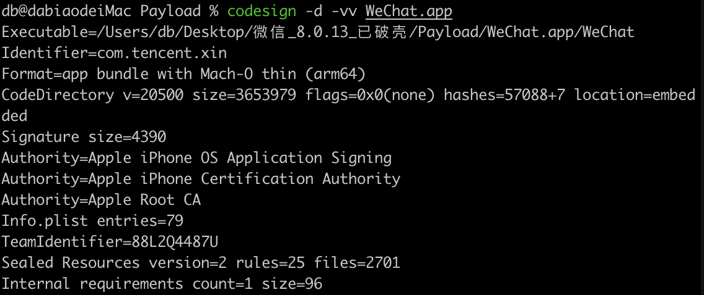

# 代码签名
代码签名是对可执行文件或者脚本进行数字签名。用来确认软件在签名后未被修改或损坏的措施。和数字签名原理相同，只不过数字签名的是代码
## 简单的代码签名介绍
在iOS出现之前，主流的操作系统(Mac/Windows)软件随便从哪里下载都能运行，系统安全存在隐患，盗版软件，病毒入侵，静默安装等。那么苹果希望解决这样的问题，要保证每一个安装到iOS上的APP都经过苹果官方允许的，就是通过代码签名。

要实现验证，最简单的方式就是通过苹果官方生成的非对称加密的一对公私钥，在iOS系统中内置一个公钥，私钥由苹果后台保存，当我们传App到AppStore的时候，苹果后台用私钥对APP数据进行签名，iOS系统下载这个APP后，用公钥验证这个签名，如果签名正确，这个APP肯定是由苹果官方后台认证的，并且没有被修改过，也就达到了苹果的需求: 保证安装的每一个APP都是经过苹果官方允许的。

如果我们的设备安装APP只从AppStore一个入口这件事就很容易解决，只要苹果官方的数字签名即可

但是安装app还有的是开发者的真机测试，所以苹果还开放了企业内部分发的渠道，企业证书签名的app也是需要安装的，这样简单的代码签名就不满足需求了。

## 苹果的需求
1. 安装包不需要上传到App Store，可以直接安装在手机上
2. 为了保证系统的安全性，又必须保证对APP的绝对控制权
    1. 经过苹果允许才可以安装
    2. 不能被滥用导致非开发APP也能安装
为了实现这些需求，iOS签名的复杂程度也就增加了，苹果的方案是双层签名

## 双层签名
iOS的双层代码签名流程。需要两个角色，一个是iOS系统，一个是我们的Mac系统。因为iOS的APP开发环境在Mac系统下。所以这个依赖关系成为了苹果双层签名的基础。

1. 在Mac系统中生成非对称加密算法的一对公钥\私钥(你的Xcode帮你办了)。这里称为公钥M 私钥M。M代表Mac
2. 苹果自己有固定的一对公私钥，跟之前的App Store原理一样，私钥在苹果后台，公钥在每个iOS系统中，这里称为公钥A。A=Apple
3. 把公钥M以及你的一些开发者信息，传到苹果后台(这个就是CSR文件)，用苹果后台的私钥A去签名公钥M。得到的一份数据包含了公钥M以及其签名。把这份数据称为证书。
4. 在开发的时候，编译一个APP后，用本地的私钥M(即导出的p12)对这个APP进行签名，同时把第三部得到的证书一起打包进APP，安装到手机上
5. 安装时，iOS取得证书，用内置的公钥A，去验证证书的数字签名
6. 验证证书后，得到了公钥M，再用公钥M去验证APP的签名。这里就验证了这个APP安装是否经过苹果的官方的允许(这里只验证安装行为，不验证APP是否被改动，因为开发阶段APP肯定是不断变化的，苹果不需要管)。

但是，如果只有双层签名的话，只要申请到一个证书，就可以安装APP所有的设备，APP Store就失去了作用了。

## 描述文件
苹果为了解决滥用的问题，又加了两个限制。
1. 限制在苹果后台经过注册的设备才能安装
2. 签名只能针对某一个APP

另外苹果还想控制App里面的iCloud/PUSH/后台运行/调试器附加这些权限，所以苹果把这些权限开关统一称为Entitlements(授权文件)。并将这些文件放在一个叫做Provisioning Profile(描述文件)文件中。

描述文件是在AppleDevelop网站创建的(在Xcode填上AppleID它会代办创建)，Xcode运行时会打包进APP内。所以我们申请证书的时候，还要申请一个东西，就是描述文件

在开发的时候，编译完一个APP后，用本地的私钥M对这个APP进行签名，同时把从苹果服务器得到的Provisioning Profile文件打包进APP里，文件名为embedded.mobileprovision，把APP安装到手机上，最后进行系统验证

## 图示



## 如何获取自己的csr文件
1. 打开钥匙串访问
2. 左上角钥匙串访问
3. 证书助理
4. 从证书颁发机构请求证书

5. 填写信息

6. 查看csr文件内的信息
```
openssl asn1parse -i -in CertificateSigningRequest.certSigningRequest
```

## 描述文件列表以及存放位置
`~/Library/MobileDevice/Provisioning Profiles/`

查看描述文件的命令
`security cms -D -i xxxxxx`

可以看到是一个plist文件

免费账号七天只能申请十个

get-task-allow 是否允许app调试的字段

允许的app的bundleID application-identifier

过期时间 ExpirationDate

允许安装的设备列表 `ProvisionedDevices`

文件的UUID `UUID`

## 查看申请到的证书



里面有公钥M和HASH值

申请到的证书会被Mac系统和私钥M关联

## xcode证书自动签发出现waiting to repair循环

应该是因为xcode版本太老了，内嵌的证书过期了

## 打包好的app中的签名查看


## 获取应用ipa包
1. 未砸壳的ipa包，可以在itune的12.6.3版本上进行ipa的下载，下载的是官方的，现在不可以下载了，可以从iMazing进行下载
2. 爱思助手上下载，什么版本的都可以，爱思助手用他的证书进行了加密
3. 越狱手机拷贝，有加密的也有未加密的

## 应用重签名(手动签名)
### 查看证书
```
security find-identity -v -p codesigning
```
### 查看加密信息
```
otool -l 二进制可执行文件 | grep crypt
```
id 为0 未加密

id 为1 已经加密 是使用id为1的一种加密算法加密的

### 查看文件系统架构
```
file 二进制文件
```

### 查看签名信息
#### 已破壳app
1. 解压ipa包
2. 进入到payload文件夹
3. `codesign -d WeChat.app` 查看app可执行文件

4. `codesign -d -v WeChat.app` 查看app详细信息

4. `codesign -d -vv WeChat.app` 查看app详细信息，带签名


### 手动重签名
0. 跑一次空工程，安装到真机，一般同名工程比较好，不要有`--`类似的非法的id
1. 只保留Payload里面的WeChat.app
2. 将包里面的Plugins和Watch删除，因为普通开发者账号重签名不了
3. framework重签
```
codesign -fs "Apple Development: xxxxxxxxxx" ProtobufLite.framework
```
4. 查看二进制可执行文件是否是可执行文件，不是的话加可执行权限
5. xcode，找到打包过的测试app，show in fiddler，显示包内容，里面有描述文件，点击一下就可以显示过没过期
6. 将描述文件拷贝至要重签名的包里面
7. 将要重签名的包里面的info.plist的bundleid修改为描述文件的bundleid
8. 新建`entitlements.plist`文件，将描述文件中的`Entitlements`部分拷贝过去。保存备用
9. 将要重签名的文件放到app包同一级目录下
```
codesign -fs "Apple Development: xxxxxx" --no-strict --entitlements=entitlements.plist WeChat.app
```
10. `codesign -d -vv WeChat.app`可以看到签名已经变成我们的了
11. 删除包在的目录下的entitlements.plist
12. `zip -ry wechat.ipa Payload` 打包
13. xcode 打开device进行安装，记得点击信任
14. 然后就可以通过debugserver进行应用调试

### xcode进行第三方应用调试
1. 获取到砸壳的应用
2. 删除不能重签名的部分
3. 新建同名工程
4. framework还得自己签名
5. 把处理过的应用包替换工程中的包，直接运行

### shell脚本重签名
1. command + shift + k 恢复到了空工程