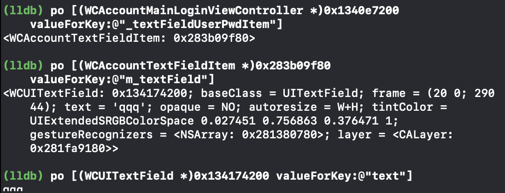

# 代码注入
修改原始的程序，是利用代码注入的方式，注入代码会选择利用FrameWork或者人Dylib等三方库的方式去注入

## 注入原理
1. 通过machoview查看二进制可执行文件
2. 可以看到文件中的Load Commands，里面是运行时要加载的动态库，都是LC_LOAD_xxxx的格式
3. 里面有一部分在系统中，有一部分在Frameworks文件夹里面
4. 双击可以看到显示出动态库的路径，有系统的路径，也有当前文件目录下的

## FrameWork注入
0. 新建工程，选好bundleid，并跑一次，让iphone信任
1. 按照应用重签名的步骤将ipa放到工程里
2. 新建Framework，记得修改targetversion
3. 在framework里面可以进行代码的编写
4. build
5. 可执行二进制文件里面现在还没有我们的framework的路径(由于脚本替换的原因，里面有路径的二进制文件已经被想调试的二进制文件替换了，文件结构还在，但是二进制文件已经变了)
6. 修改macho，使之加载我们的动态文件，使用yololib
7. 将ipa放入工程
8. 解压ipa，在二进制可执行文件目录下`yololib WeChat Frameworks/DbHook.framework/DbHook`
9. 删除没用的，只剩payload
10. `zip -ry WeChat.ipa Payload`
11. 删除Payload
12. commad+shift+k 清除缓存
13. command+r 查看运行结果
14. 问题，如果出现说找不到framework的问题，可以尝试将原来的framework的注入删除(e开头的包含framework的选项)，在chat的BuildPhases，然后再选择New Copy Files Phases。选择frameworks的格式，将自己的添加。Copy only when installing可以不勾选。xcode 版本为12.5.1
15. 补充，上面的是由于build pharse的执行顺序问题，把run script调整到framework的拷贝之前就行了

## dylib 注入
dylib 是macos的库
0. 新建工程，选好bundleid，并跑一次，让iphone信任
1. target新建一个dylib，并将Base SDK改为iOS的，sign的证书有的也要改为iphone develope
2. 在chat的BuildPhases，然后再选择New Copy Files Phases。选择frameworks的格式，将自己的添加。Copy only when installing不勾选。xcode 版本为12.5.1
3. sh脚本修改了yololib的注入命令
4. 把ipa包放进去
5. commad+shift+k 清除缓存
6. 运行
7. 有些版本xcode直接添加copyfiles不行了，会报错，镜像签名不对，就要用下面的方法
    0. 新建工程，选好bundleid，并跑一次，让iphone信任
    1. target新建一个dylib，并将Base SDK改为iOS的，sign的证书有的也要改为iphone develope
    2. 跑一次获取dylib
    3. 解压ipa包
    4. 将dylib添加到app包中
    5. 压缩`zip -ry WeChat.ipa Payload`
    6. 删除Payload
    7. commad+shift+k 清除缓存
    8. sh脚本修改了yololib的注入命令
    9. 添加启动脚本
    10. 运行

## OC的MethodSwizzle
利用OC的Runtime特性，动态改变SEL(方法编号)和IMP(方法实现)的对应关系，达到OC方法调用改变流程的目的，主要用于OC方法

OC中，SEL和IMP之间的关系，就好像一本书的目录，SEL是方法编号，就像标题一样，IMP是方法实现的真实地址，就像页码一样


## 破坏微信注册
1. 在手机上进行微信的调试，准备工作做好
2. 打开调试窗口
3. 点击注册按钮，注意不要点到label，应该是一个button
4. 如果target和action是__NSDictionaryI，在lldb使用 `po (__NSDictionaryI *)0x283c39d80` 就可以看到name和memory address。
5. 调用类方法 p\[类名 方法名\]  `p [WCAccountLoginControlLogic onFirstViewRegister]`  `p [(WCAccountLoginControlLogic *)0x280380910 onFirstViewRegister]`
6. 如果找不到控制器，可以用classdump进行头文件导出进行寻找，在sublime打开直接搜索类名
7. 可以看到WCAccountLoginControlLogic有onFirstViewRegister方法
8. 用framework注入代码，原理为MethodSwizzle

## 窃取微信密码
1. 在手机上进行微信的调试，准备工作做好
2. 手机点到微信号邮箱登陆，点击调试
3. 找到TextField
4. 看target和action
5. 用lldb调用，然后继续运行，看看有没有效果
6. 有效果，目的，点击登录按钮的时候，调用onNext方法。
7. onNext方法传递的是controller对象，不能对传递的参数下手，只能是去看控制器里面有没有pwd参数，在头文件中查找，看到了WCAccountTextFieldItem *_textFieldUserPwdItem;属性。但是我们要找的是WCUITextField，因此再去找WCAccountTextFieldItem里面没有WCUITextField，再去找WCAccountTextFieldItem的父类WCBaseTextFieldItem找到了WCUITextField *m_textField;
8. po [(WCAccountMainLoginViewController *)0x1340e7200 valueForKey:@"_textFieldUserPwdItem"] 读取了这个属性的内存地址值

9. method swizzle之后出现了bad implications。后来检查是framework的版本和iOS的版本不一样

## [self my_next]调用崩溃原理
1. url那个相当于NSURL的多肽，两个方法都是本身里面的，所以直接self调用。
2. wechat里面，my_next中的self是指的controller里面的类，这个类本身没有my_next方法。
3. 解决方法，用controller的分类，但是我们不知道微信的源码，所以不能添加分类，读不到原始的类。所以我们可以通过向controller添加my_next方法来解决
```
+ (void)load{
    // 1. 拿到原始的method
    Method old_method = class_getInstanceMethod(objc_getClass("WCAccountMainLoginViewController"), @selector(onNext));
    //2. 添加新方法
    BOOL didAddMethod = class_addMethod(objc_getClass("WCAccountMainLoginViewController"), @selector(new_onNext), my_next, "v@:");
    //3. 交换
    method_exchangeImplementations(old_method,  class_getInstanceMethod(objc_getClass("WCAccountMainLoginViewController"), @selector(new_onNext)));
}

// self 是对象的id _cmd是方法编号，有参数的话，就在后面再加参数
void my_next(id self, SEL _cmd){
        NSString * pwd = [[[self valueForKey:@"_textFieldUserPwdItem"] valueForKey:@"m_textField"] performSelector:@selector(text)];
        NSLog(@"🍺🍺🍺🍺🍺🍺🍺🍺🍺🍺🍺密码是%@", pwd);
        [self performSelector:@selector(new_onNext)];
}

```

4. 类的replace
```
// 类replace方法


+ (void)load{
    // 1. 拿到原始的method
    old_method = method_getImplementation(class_getInstanceMethod(objc_getClass("WCAccountMainLoginViewController"), @selector(onNext)));
    //2. 添加新方法
    class_replaceMethod(objc_getClass("WCAccountMainLoginViewController"), @selector(onNext), my_next, "v@:");
}

IMP (*old_method)(id self, SEL _cmd);

// self 是对象的id _cmd是方法编号，有参数的话，就在后面再加参数
void my_next(id self, SEL _cmd){
    NSString * pwd = [[[self valueForKey:@"_textFieldUserPwdItem"] valueForKey:@"m_textField"] performSelector:@selector(text)];
    NSLog(@"🍺🍺🍺🍺🍺🍺🍺🍺🍺🍺🍺密码是%@", pwd);
    old_method(self, _cmd);
}
```
弊端，没有的话replace会帮你添加
5. getIMP和setIMP
```
// get set
+ (void)load{
    // 1. get 拿到原始的method
    Method onNext = class_getInstanceMethod(objc_getClass("WCAccountMainLoginViewController"), sel_registerName("onNext"));
    
    // 2. 保存原始的imp
    //sel_registerName 避免代码中太多提示
    old_onNext = method_getImplementation(onNext);
    //2. set
    method_setImplementation(onNext, (IMP)my_next);
}

IMP (*old_onNext)(id self, SEL _cmd);

// self 是对象的id _cmd是方法编号，有参数的话，就在后面再加参数
void my_next(id self, SEL _cmd){
    NSString * pwd = [[[self valueForKey:@"_textFieldUserPwdItem"] valueForKey:@"m_textField"] performSelector:@selector(text)];
    NSLog(@"🍺🍺🍺🍺🍺🍺🍺🍺🍺🍺🍺密码是%@", pwd);
    old_onNext(self, _cmd);
}
```

## 课后补充
"v@:" 是返回值类型 
command + shift + 0 查看 class_addMethod的描述

`method_getTypeEncoding`可以直接获得