# HOOK

## HOOK概述
HOOK，中文译为"挂钩"或者"钩子"。在iOS逆向中是指改变程序运行流程的一种技术。通过hook可以让别人的程序执行自己所写的代码。

## iOS中HOOK技术的几种方式
1. Method Swizzle

    利用OC的Runtime特性，动态改变SEL(方法编号)和IMP(方法实现)的对应关系，达到OC方法调用流程改变的目的。主要用于OC方法。

2. fishhook

    是facebook提供的一个动态修改链接mach-o文件的工具。利用MachO文件加载原理，通过修改懒加载和非懒加载两个表的指针达到C函数的HOOK的目的

3. Cydia Substrate

    Cydia Substrate 原名为Mobile Substrate，主要针对OC方法，C函数以及函数地址进行HOOK操作。并不仅仅针对iOS设计，安卓一样可用

## Cydia Substrate(MobileHooker)
定义了一系列的宏和函数，底层调用objc的runtime和fishhook来替换系统或者目标应用的函数。

其中有两个函数
    * MSHookMessageEx 主要用于Objective-C方法 `void MSHookMessageEx(Class class, SEL selector IMP replacement, IMP result)`
    * MSHookFunction 主要用于C和C++函数，logos语法的HOOK就是对此函数做的封装

* MobileLoader 用于加载第三方的dylib在运行的应用程序中。启动时MobileLoader会根据规则把指定目录的第三方的动态库加载进去，第三方动态库也就是我们写的破解程序

* safe mode 破解程序本质是dylib，寄生在别人程序里。系统进程一旦出错，可能导致整个进程崩溃，造成iOS瘫痪。所以引入了安全模式，在安全模式下所有的基于CydiaSubstrate的三方dylib都会被禁用，便于查错与修复

## FishHook

### FishHook 使用

### 共享缓存机制
在程序的启动过程中dyld有加载共享缓存库

苹果不允许第三方的动态库

不同的app使用的相同的系统函数库只会加载一个，作为大家共享使用。当使用到系统库中的函数的时候，dyld会将库的地址给程序，程序就可以进行访问

越狱的手机就可以导出iOS的共享缓存库

电脑的共享缓存库在`/private/var/db/dyld/` 10.14版本在 big sur 不在，在`/System/Library/dyld` 好像是为了电脑与手机生态的适配

手机的共享缓存库在system目录下

### FishHook
可以Hook系统函数，不能Hook自定义函数。

OC可以Hook是因为OC是动态语言。通过运行时去找到方法的实现。通过SEL去找IMP。我们可以在这动手脚

C函数，静态语言。func。在汇编中是一个bl跳转指令。跳转到一个确定的函数地址。我们要改只能去改macho里面的二进制，不好改。

OC里面，调用函数，是通过msg_send，函数运行的时候才回去找。我们可以在运行前去改。

FishHook的原理，为什么FishHook可以HookNSLog？(NSLog是C函数)。

因为NSLog是系统动态缓存库里面的，在编译的时候并不知道NSLog的地址，运行的时候才知道。但是这样C语言就没办法编译了，因为没有确定的函数地址。

为了解决这个问题，苹果提出了一个新的技术，位置独立代码(PIC)。在Macho文件的内部的_DATA段建立一个指针，指向外部函数，比如动态库里面的函数。也就是说编译的时候NSLog的bl指向的是PIC里面的外部函数的指针，可能是随便给的地址值。

dyld加载的时候，还会做链接bind，会修改_DATA里面的外部函数指针值，指向正确的NSLog。

myNSLog是我们自己写的，地址就在我们的MacO文件中，知道确切的地址，会把自己的myNSLOg的地址给位置独立代码里的NSLog。在dyldbind的时候，会把系统的NSLog的地址给自己定义的旧函数的指针

外部函数指针值在懒加载的部分，懒加载的部分只有在第一次使用函数的时候才会将内存地址绑定为系统函数的位置。后面就都会使用系统函数的地址。但是因为懒加载的地址是可读可写的，所以即使前面调用过已经绑定了系统的地址，也可以Hook

#### 在例子中解释懒加载过程
新建项目，在ViewController.m中添加
```

- (void)viewDidLoad {
    [super viewDidLoad];
    // Do any additional setup after loading the view.
    NSLog(@"哈哈");
    
}

```

然后build，找到生成的二进制文件，然后用machoview打开，可以看到在懒加载指针中，说明只有在调用的时候才会链接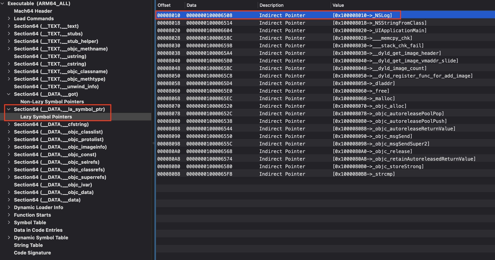

然后打断点，运行，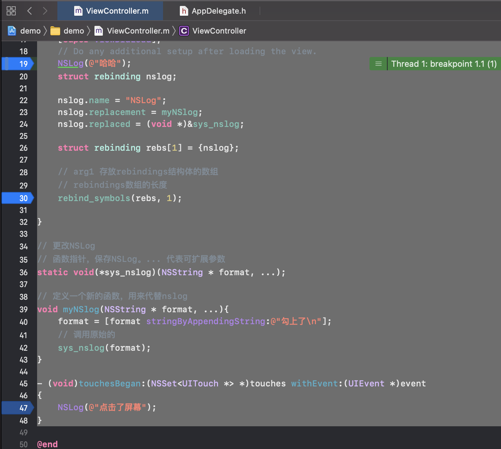

断点处停下后，可以通过lldb的指令，image list去查看加载的image，找到macho文件的首地址 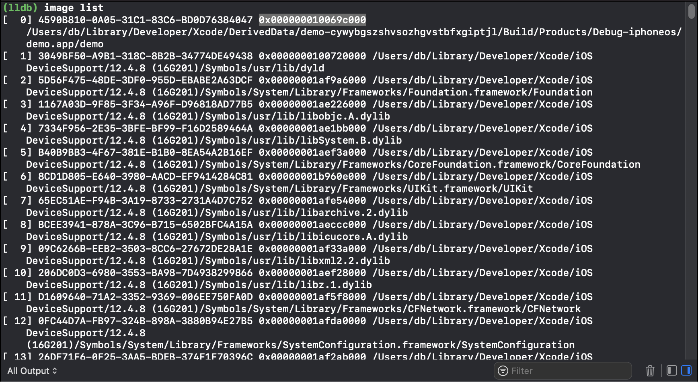


1. 第一次NSLog运行前
通过MachOview中的NSLog指针的offset偏移量加上MachO文件的首地址，在lldb中进行查看懒加载指针中NSLog的指针的值，在没有运行NSLog的时候 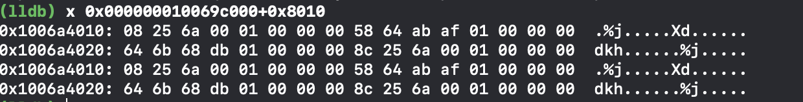

从右往左数 前面八个是 0x 00 00 00 01 00 6a 25 08

用dis -s 加上数字去找汇编代码，是垃圾值，没有意义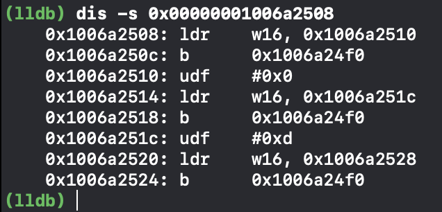

通过汇编成查看，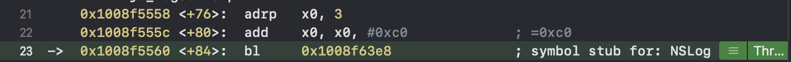

2. 向下调试
NSLog运行了一次，输出了哈哈。
再次查看地址内的内容，已经定位到了系统的NSLog函数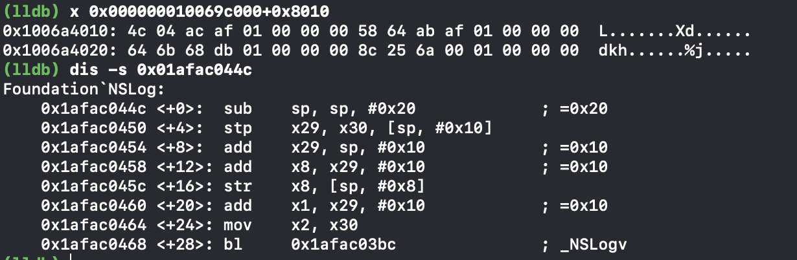

#### 汇编代码查看懒加载过程
1. 代码
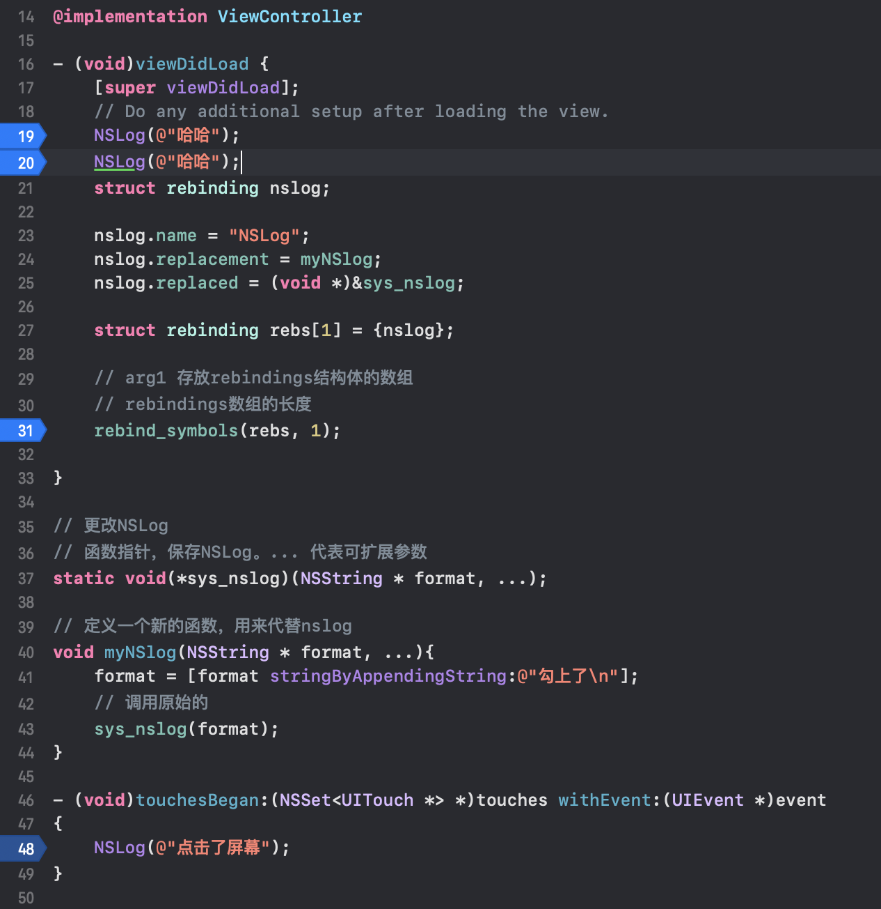

2. 汇编查看
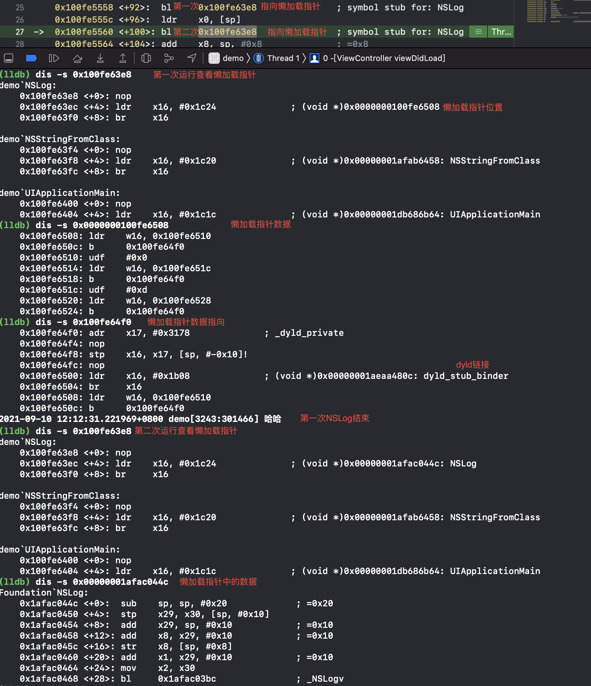

#### 查看fishHook的过程
1. 代码
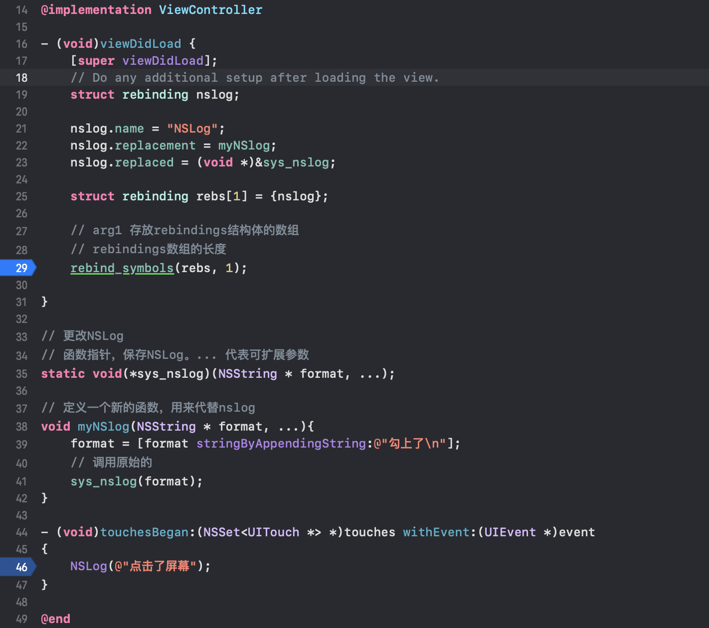
2. 查看未Hook前的内存地址指向的汇编
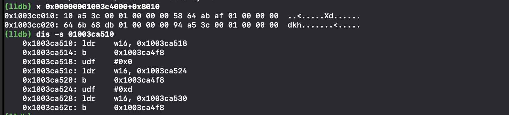
3. 查看Hook后指向的汇编
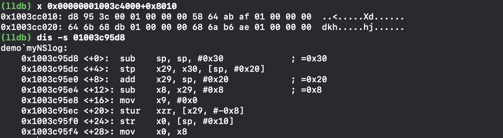
4. rebind_symbols里面去给内存地址赋值
### 偏移地址
代码在文件中的偏移地址不会变，因为没有加入代码


### 通过符号去找到字符串

FishHook不可能修改物理文件，我们的只读可读可写都是指的内存中的


1. 在Lazy Symbol Pointers里面找到NSLog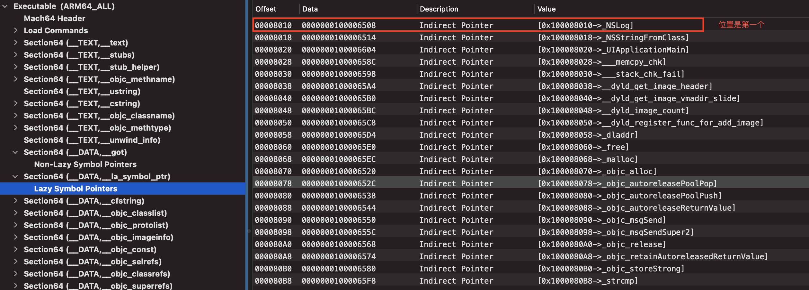在第一个
2. 再去indirect Symbols里面对应的位置第一个找到NSLog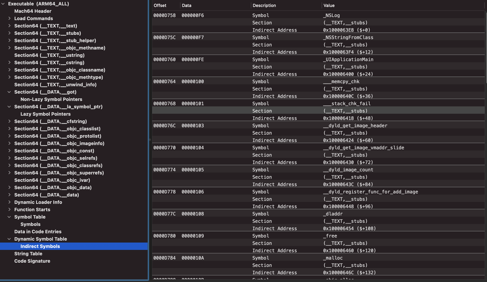
3. 再根据indirect Symbols中的Data`0xF6`去SymbolTable找到NSLog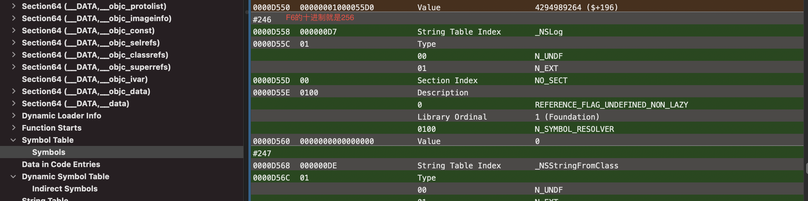

4. 再根据SymbolTable的Data`0xD7`，在string table找到NSLOg的函数名相对于StringTable的偏移量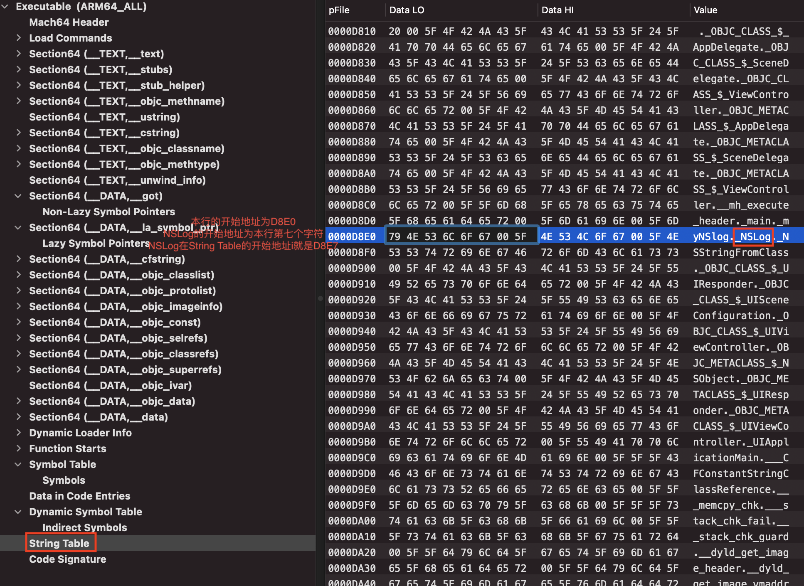 偏移量是`0xD8E7 - 0xD810 = 0xD7`


### 初探Hook防护
#### 在viewcontroller中用load进行防护
1. 在viewcontroller的load中用fishHook添加了用来hook`method_exchangeImplementations`的代码
```
@implementation ViewController

+ (void)load{
    
    NSLog(@"ViewController + load");
    // 防护method_exchange
    struct rebinding bd;
    bd.name = "method_exchangeImplementations";
    bd.replacement = myExchange;
    bd.replaced = (void * )&exchangeP;
    
    struct rebinding rebs[1] = {bd};
    
    rebind_symbols(rebs, 1);
    
}

void (*exchangeP)(Method _Nonnull m1, Method _Nonnull m2);

void myExchange(Method _Nonnull m1, Method _Nonnull m2){
    NSLog(@"监测到Hook");
}

- (void)viewDidLoad {
    [super viewDidLoad];
    // Do any additional setup after loading the view.
}

- (IBAction)btnclick1:(id)sender {
    NSLog(@"按钮1");
}
- (IBAction)btnclick2:(id)sender {
    NSLog(@"按钮2");
}

@end
```
2. 用远来的Framework的注入代码，注入下面的内容
```
#import "InjectCode.h"
#import <objc/runtime.h>
@implementation InjectCode
+(void)load
{
    NSLog(@"开始Hook");
    Method old_method = class_getInstanceMethod(objc_getClass("ViewController"), @selector(btnclick1:));
    Method new_method = class_getInstanceMethod(self, @selector(myBtn));
    method_exchangeImplementations(old_method, new_method);
}

-(void)myBtn{
    NSLog(@"Hook成功");
}
@end

```
3. 运行，发现framework的load先运行，viewcontroller的hook后运行，还是被替换了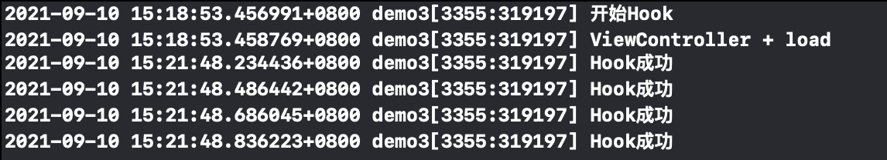

4. 引起顺序问题的原因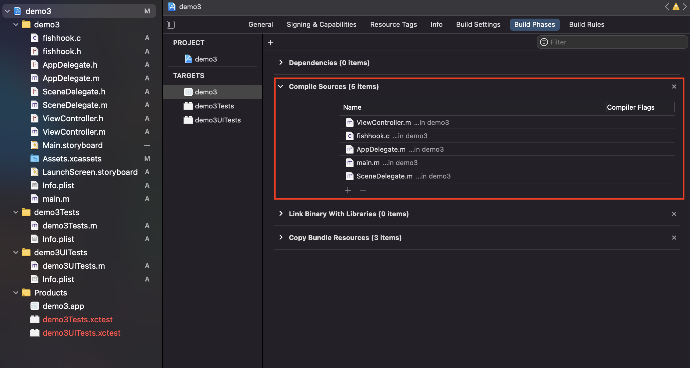

5. 因为framework的load都是比主程序的load先运行，所以三方注入的framework会先运行。
6. 如果我们添加自己的framework进行exchange_method的hook，就会比第三方的先运行，就能达到防护的目的了。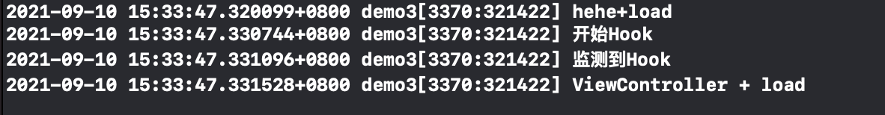hehe是我们自己的framework，里面是原来viewcontroller的防护代码,开始hook是注入的framework。


### 防护MonkeyDev

1. 安装
2. 熟悉使用
3. MonkeyDev注入了cyript，还有libsubstrate(cydia的)。
4. 里面可以用logos语法
5. 防护的时候hook，setget就可以了
6. 破解的时候，在exit进行符号断点。然后进行分析。一般的动态断点调试会不好分析，一般用净态分析