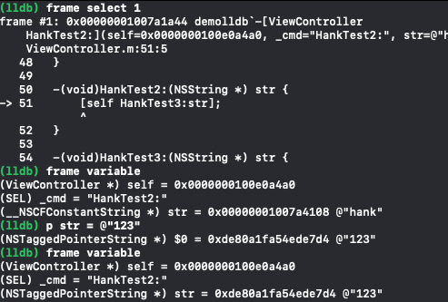

# LLDB(Low Lever Debug)
默认内置于Xcode中的动态调试工具。标准的LLDB提供了一组广泛的命令，旨在与老版本的GDB命令兼容。除了使用标准配置外，还可以很容易的自定义LLDB以满足实际需要

逆向的时候没办法用图形化界面去下断点

## 命令例子
可以直接用调试的暂停来打断点

1. `breakpoint set -n test1` 给名称为test1的函数下断点
2. `breakpoint set -n "[ViewController save:]" -n "[ViewController pause:]" -n "[ViewController continueGame:]"` 同时给ViewController中的三个方法打断点，这三个断点同属一组，可以同时的启用禁用
3. `breakpoint list` 查看断点列表
4. `c` 继续
5. `breakpoint disable 3` 禁用第三组的断点
6. `breakpoint disable 3.2` 禁用第三组的第二个断点
7. `breakpoint enable 3` 启动第三组的断点
8. `breakpoint enable 3.2` 启动第三组的第二个断点
9. `breakpoint delete 1` 删除第一组的断点，只能删除一组的，不能删除一组中的单独一个
10. `breakpoint delete 1.1` 禁用第一组的第一个断点，删除指定组的某一个的时候，会变成禁用
11. `breakpoint set --selector touchesBegan:withEvent:` 筛选出所有包含`touchesBegan:withEvent:`的打断点
12. `breakpoint delete` 清空所有的断点
13. `breakpoint set --file ViewController.m --selector touchesBegan:withEvent:` 对某个文件中的某个类的某个方法下断点
14. `breakpoint set -r Game:`遍历所有带有Game字段的都打上断点

## 缩写例子
1. `b -r Game:` 遍历所有带有Game字段的都打上断点
2. `break list` 查看断点列表
3. `break dis 1.2` 禁用1.2断点

## 执行代码
1. `expression self` 查看当前所在的类
2. `expression self.view.subviews` 查看当前类(ViewController)下面的subviews
3. p 就是expression的简写
4. `po` 相当于`expression -o` 查看当前的类的描述
5. `p [self.models addObject:[[Person alloc] init]];` 运行后面的代码
6. `p self.models.lastObject` 得到结果`(Person *) $3 = 0x0000000281da7920` `$3`代表当前环境的第三个局部变量
7. `p (Person *)self.models.lastObject` 对局部变量做一个强制类型转换，当前的调试环境就知道了该变量的数据类型，就可以直接在lldb对局部变量做赋值。`p $4.name = @"hank"` 或者是 `p [$4 setValue:@"hank1" forKey:@"name"];`
8. `p`命令会返回一个局部变量，`po`命令会返回一个描述，并不会反回变量。对于取出的指针类型做修改，会体现在内存中，取出的非指针变量，做修改并不会体现在内存里。

## 查看堆栈信息
1. `bt` 查看堆栈信息。
2. `up` 来到堆栈的上一级
3. `frame select frame的值` 直接进入堆栈的某一级
4. `frame varible` 查看当前级的参数。还可以修改参数
5.  但是修改了参数之后，不会起作用，因为执行已经到了最后一级
6. `thread return` 会滚到上一级，回滚后不会再执行后面的代码，相当于保存当前状态推出

## 流程控制
`c` 继续执行
`n` 单步向下
`s` 遇到函数进入
`si` 汇编级别的
`ni` 汇编级别的

## 内存断点
1. watchpoint set variable p->_name 给p的name下断点，一调整就断

## breakpoint command add
breakpoint commad add n
在第n个断点处加指令

## target stop-hook
### target stop-hook add -o "frame variable"
断住地时候查看栈
### target stop-hook list 
查看hook的命令
### target stop-hook delete
删掉所有的指令
### target stop-hook disable
禁用指令

## 配置lldb
`vim ~/.lldbinit`
可以把`target stop-hook`放进去
